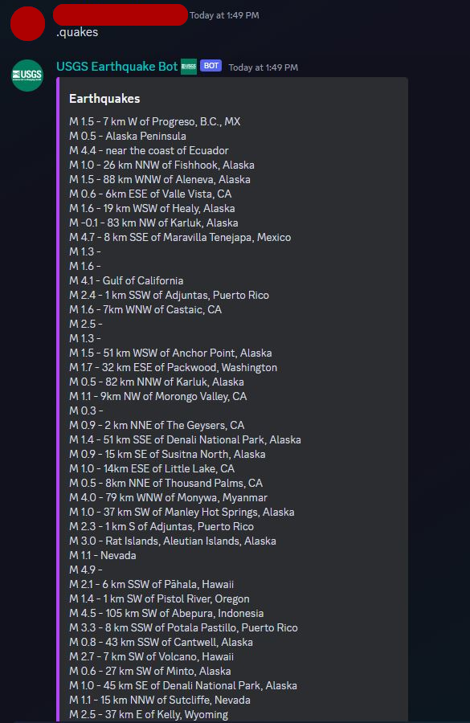
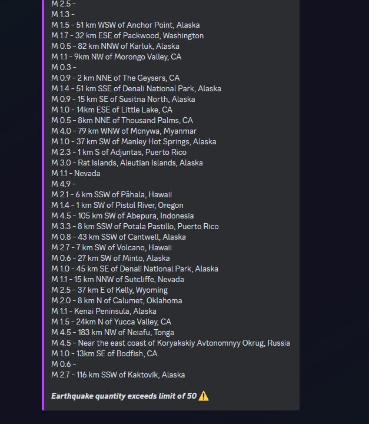
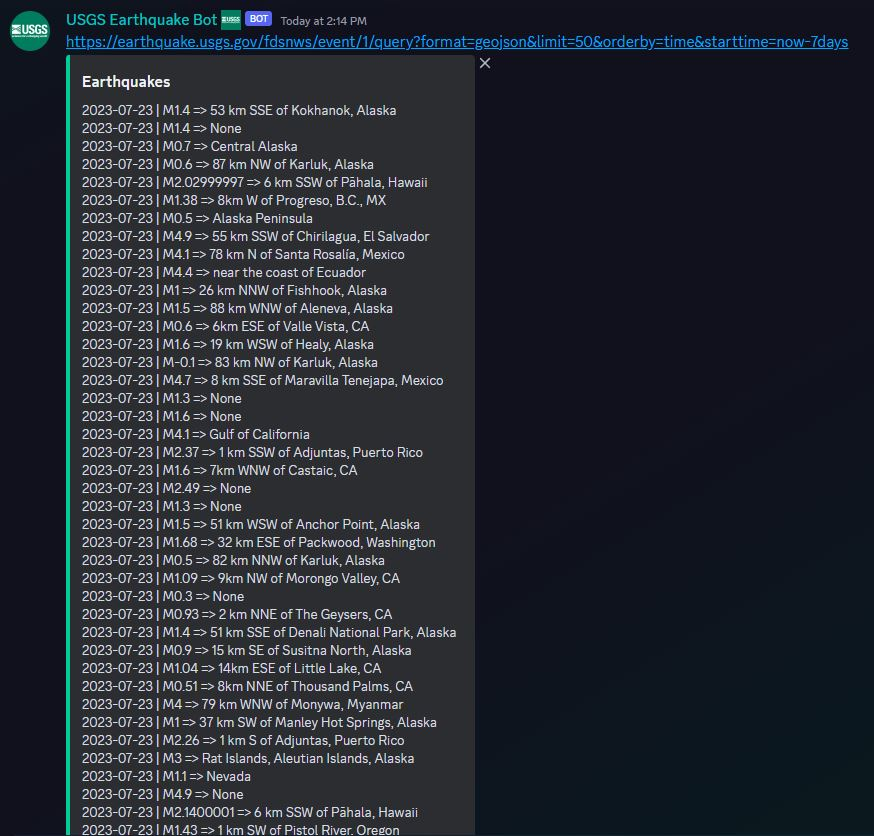
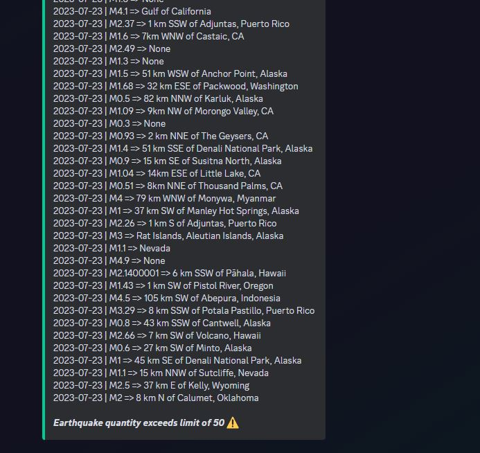
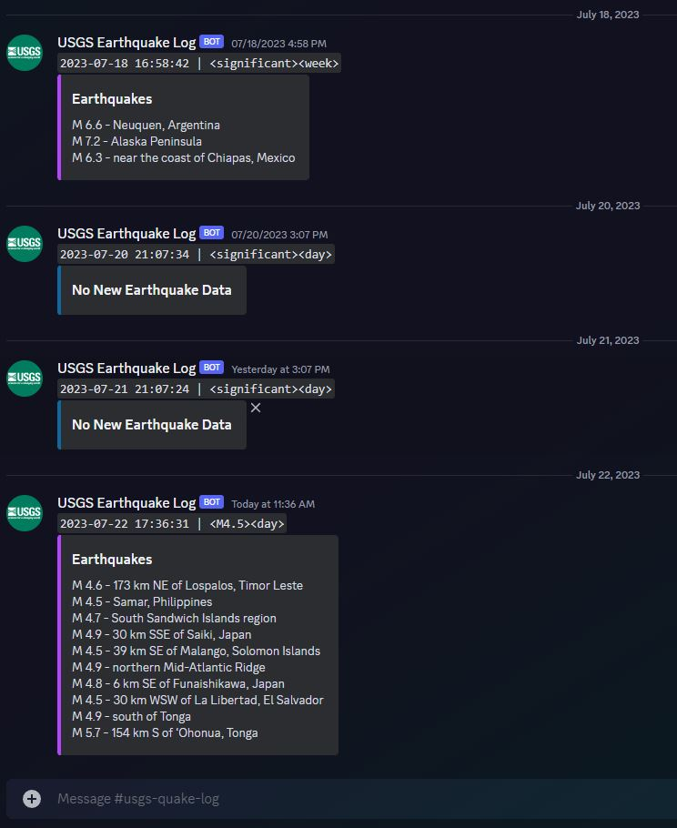

<p align="center">
    <a href="#"></a>
</p>

<br>

# USGS Earthquake GeoJSON API

> A simple USGS Earthquake GeoJSON API parser and integrations with Discord.

<a href="#"></a>
<a href="#"></a>
<a href="#"></a>
<a href="#"></a>
<a href="#"></a>

## Overview

- A hosted **Discord Bot** allows users to query *Earthquake-API* data with simple commands.
- **GitHub Action Workflow** builds and runs the job **every day**, at **3:00PM**. `(00 21 * * *)`
- **USGS API Feed** is parsed and pulled to find *GeoJSON* data for `significant` magnitudes over a `week` interval.
- A finalized Earthquake Summary, as an embedded message, is sent to multiple **Discord Webhook URLs**.

> *Note: All Discord Integration Tokens/URLs are stored for security through **Secrets**. Details further below.*

<br>

[](https://github.com/LordBramster/USGS-GeoJSON-API-Discord/actions/workflows/actions.yml)

## GeoJSON Data

**GeoJSON** is a geospatial data interchange format based on **JavaScript Object Notation (JSON)**.  

It defines several types of JSON objects and the manner in which they are combined to represent data about geographic features, their properties, and their spatial extents. GeoJSON uses a geographic coordinate reference system, World Geodetic System 1984, and units of decimal degrees.

### Sample of GeoJSON Feature Collection:
```
{ "type": "FeatureCollection",
  "features": [
    { "type": "Feature",
      "geometry": {"type": "Point", "coordinates": [102.0, 0.5]},
      "properties": {"prop0": "value0"}
      },
    { "type": "Feature",
      "geometry": {
        "type": "LineString",
        "coordinates": [
          [102.0, 0.0], [103.0, 1.0], [104.0, 0.0], [105.0, 1.0]
          ]
        },
      "properties": {
        "prop0": "value0",
        "prop1": 0.0
        }
      },
    { "type": "Feature",
        "geometry": {
          "type": "Polygon",
          "coordinates": [
            [ [100.0, 0.0], [101.0, 0.0], [101.0, 1.0],
              [100.0, 1.0], [100.0, 0.0] ]
            ]
        },
        "properties": {
          "prop0": "value0",
          "prop1": {"this": "that"}
          }
        }
      ]
    }
```

## Discord Integration

Using Discord, an Earthquake Bot would centralize earthquake-related information within the platform, making it convenient for members to access vital updates and resources without leaving the Discord environment. This streamlined access to information can enhance community preparedness and response during seismic events.

### Bot Integration (USGS Earthquake Bot)

The **USGS Earthquake Bot** responds to two commands:
<br>
`.quakes` - *reports up to 50 Quakes, over the past 24-Hours, using just the `Title` property.*
<br>
`.earthquakes` - *reports up to 50 Earthquakes, based on whatever `api-query` the member sends in the command.*

When a member sends one of these commands in the chat, the Bot "listens" to the message, connects to the USGS Earthquake API, fetches the latest earthquake data in GeoJSON, and then shows it in the chat as a response:

<p align="center">
    <a href="#">
      
      
      
      
    </a>
</p>

### Webhooking
Once the `Workflow Job` finishes, an **embedded message** is sent to the **Webhook URL**.
- All Discord-Webhook URLs on this Repo are safely stored as environment variables and GitHub secrets.
- When the `Workflow Job` executes, it will pull the Secret from the repo into a local environment var on the server instance.
- The script will ping each URL found within the converted list of Webhook URLs.

> *As an example, the Webhook URLs are parsed from: `'["https://discord.com/api/webhooks/...", "https://discord.com/api/webhooks/...", "etc"]'`.
> It will parse the string list with `json.loads()` to convert the secret into a readable list of Webhook URLs, and then continue the script.*

<p align="center">
    <a href="#">
      
    </a>
</p>


> Using `usgs_geojson_webhook_config` is the preferred method for secure/private/prod environments. For demonstration purposes via GitHub Actions, this method was changed to using Secret Vars.

## USGS-API Feed URLs:

Collection of available API Feed URLs, utilizing `JSON` to structure URLs by **Interval** and **Magnititude**.

```
{
  "query": {
    "url": "https://earthquake.usgs.gov/fdsnws/event/1/query?format=geojson"
  },
  "feed": {
    "hour": {
      "M1.0": "https://earthquake.usgs.gov/earthquakes/feed/v1.0/summary/1.0_hour.geojson",
      "M2.5": "https://earthquake.usgs.gov/earthquakes/feed/v1.0/summary/2.5_hour.geojson",
      "M4.5": "https://earthquake.usgs.gov/earthquakes/feed/v1.0/summary/4.5_hour.geojson",
      "all": "https://earthquake.usgs.gov/earthquakes/feed/v1.0/summary/all_hour.geojson",
      "significant": "https://earthquake.usgs.gov/earthquakes/feed/v1.0/summary/significant_hour.geojson"
    },
    "day": {
      "M1.0": "https://earthquake.usgs.gov/earthquakes/feed/v1.0/summary/1.0_day.geojson",
      "M2.5": "https://earthquake.usgs.gov/earthquakes/feed/v1.0/summary/2.5_day.geojson",
      "M4.5": "https://earthquake.usgs.gov/earthquakes/feed/v1.0/summary/4.5_day.geojson",
      "all": "https://earthquake.usgs.gov/earthquakes/feed/v1.0/summary/all_day.geojson",
      "significant": "https://earthquake.usgs.gov/earthquakes/feed/v1.0/summary/significant_day.geojson"
    },
    "week": {
      "M1.0": "https://earthquake.usgs.gov/earthquakes/feed/v1.0/summary/1.0_week.geojson",
      "M2.5": "https://earthquake.usgs.gov/earthquakes/feed/v1.0/summary/2.5_week.geojson",
      "M4.5": "https://earthquake.usgs.gov/earthquakes/feed/v1.0/summary/4.5_week.geojson",
      "all": "https://earthquake.usgs.gov/earthquakes/feed/v1.0/summary/all_week.geojson",
      "significant": "https://earthquake.usgs.gov/earthquakes/feed/v1.0/summary/significant_week.geojson"
    },
    "month": {
      "M1.0": "https://earthquake.usgs.gov/earthquakes/feed/v1.0/summary/1.0_month.geojson",
      "M2.5": "https://earthquake.usgs.gov/earthquakes/feed/v1.0/summary/2.5_month.geojson",
      "M4.5": "https://earthquake.usgs.gov/earthquakes/feed/v1.0/summary/4.5_month.geojson",
      "all": "https://earthquake.usgs.gov/earthquakes/feed/v1.0/summary/all_month.geojson",
      "significant": "https://earthquake.usgs.gov/earthquakes/feed/v1.0/summary/significant_month.geojson"
    }
  }
}
```

## Resources
- https://www.usgs.gov/products/web-tools/apis
- https://www.usgs.gov/tools/earthquake-notifications-feeds-and-web-services 
- https://earthquake.usgs.gov/fdsnws/event/1/
- https://earthquake.usgs.gov/earthquakes/feed/v1.0/geojson_detail.php
- https://geojson.org/

