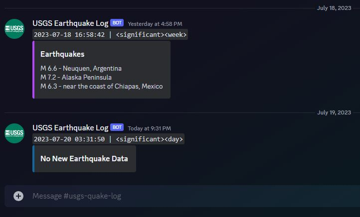

<p align="center">
    <a href="#"></a>
</p>

<br>

# USGS Earthquake GeoJSON API

> A simple USGS Earthquake GeoJSON API parser and an integration with Discord Webhooks.

<a href="#"></a>
<a href="#"></a>
<a href="#"></a>
<a href="#"></a>
<a href="#"></a>

## Overview

- **GitHub Action Workflow** builds and runs the job **every day**, at **3:00PM**. `(00 21 * * *)`
- **USGS API Feed** is parsed and pulled to find Earthquake data for `significant` magnitudes over a `week` interval.
- A finalized Earthquake Summary, as an embedded message, is sent to multiple **Discord Webhook URLs**.

> *Note: Webhook links are stored for security through **Secrets** on the public repository. Details further below.*

<br>

[](https://github.com/LordBramster/USGS-GeoJSON-API-Discord/actions/workflows/actions.yml)


## Discord Webhooking

Once the `Workflow Job` finishes, an **embedded message** is sent to the **Webhook URL**.
- All Discord-Webhook URLs on this Repo are safely stored as environment variables and GitHub secrets.
- When the `Workflow Job` executes, it will pull the Secret from the repo into a local environment var on the server instance.
- The script will ping each URL found within the converted list of Webhook URLs.

> *As an example, the Webhook URLs are parsed from: `'["https://discord.com/api/webhooks/...", "https://discord.com/api/webhooks/...", "etc"]'`.
> It will parse the string list with `json.loads()` to convert the secret into a readable list of Webhook URLs, and then continue the script.*

<p align="center">
    <a href="#"></a>
</p>

> Using `usgs_geojson_webhook_config` is the preferred method for secure/private/prod environments. For demonstration purposes via GitHub Actions, this method was changed to using Secret Vars.

## USGS-API Feed URLs:

Collection of available API Feed URLs, through a custom built `JSON` file structuring URLs by **Interval** and **Magnititude**.

```
{
  "feed": {
    "hour": {
      "M1.0": "https://earthquake.usgs.gov/earthquakes/feed/v1.0/summary/1.0_hour.geojson",
      "M2.5": "https://earthquake.usgs.gov/earthquakes/feed/v1.0/summary/2.5_hour.geojson",
      "M4.5": "https://earthquake.usgs.gov/earthquakes/feed/v1.0/summary/4.5_hour.geojson",
      "all": "https://earthquake.usgs.gov/earthquakes/feed/v1.0/summary/all_hour.geojson",
      "significant": "https://earthquake.usgs.gov/earthquakes/feed/v1.0/summary/significant_hour.geojson"
    },
    "day": {
      "M1.0": "https://earthquake.usgs.gov/earthquakes/feed/v1.0/summary/1.0_day.geojson",
      "M2.5": "https://earthquake.usgs.gov/earthquakes/feed/v1.0/summary/2.5_day.geojson",
      "M4.5": "https://earthquake.usgs.gov/earthquakes/feed/v1.0/summary/4.5_day.geojson",
      "all": "https://earthquake.usgs.gov/earthquakes/feed/v1.0/summary/all_day.geojson",
      "significant": "https://earthquake.usgs.gov/earthquakes/feed/v1.0/summary/significant_day.geojson"
    },
    "week": {
      "M1.0": "https://earthquake.usgs.gov/earthquakes/feed/v1.0/summary/1.0_week.geojson",
      "M2.5": "https://earthquake.usgs.gov/earthquakes/feed/v1.0/summary/2.5_week.geojson",
      "M4.5": "https://earthquake.usgs.gov/earthquakes/feed/v1.0/summary/4.5_week.geojson",
      "all": "https://earthquake.usgs.gov/earthquakes/feed/v1.0/summary/all_week.geojson",
      "significant": "https://earthquake.usgs.gov/earthquakes/feed/v1.0/summary/significant_week.geojson"
    },
    "month": {
      "M1.0": "https://earthquake.usgs.gov/earthquakes/feed/v1.0/summary/1.0_month.geojson",
      "M2.5": "https://earthquake.usgs.gov/earthquakes/feed/v1.0/summary/2.5_month.geojson",
      "M4.5": "https://earthquake.usgs.gov/earthquakes/feed/v1.0/summary/4.5_month.geojson",
      "all": "https://earthquake.usgs.gov/earthquakes/feed/v1.0/summary/all_month.geojson",
      "significant": "https://earthquake.usgs.gov/earthquakes/feed/v1.0/summary/significant_month.geojson"
    }
  }
}
```

## Resources
- https://www.usgs.gov/products/web-tools/apis
- https://www.usgs.gov/tools/earthquake-notifications-feeds-and-web-services 
- https://earthquake.usgs.gov/fdsnws/event/1/
- https://earthquake.usgs.gov/earthquakes/feed/v1.0/geojson_detail.php

